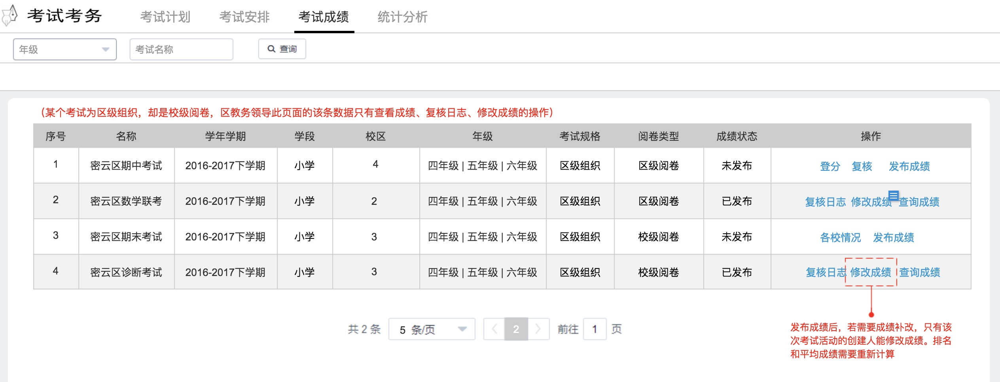

### 图示


### 显示条数
区级排考+区级阅卷 `条数=1` 
区级排考+校级阅卷 `条数=学校数+1`
因为区级排考最终要生成区级平均分，和区级排名。当每个学校都发布成绩后，由区级管理员发布
区级成绩，所以多出来的1条就是总的区级状态。 
考试计划发布时生成

### 各校情况
查看当前考试计划成绩发布情况，好确认生成区级平均成绩和排名  


### 接口规则
```
列表 /examScore/list      get
登分入口-班级 /examScore/class  get
登分页 /examScore/student     get
复核入口 /examScore/review/list get
复核页 /examScore/review/ get

```